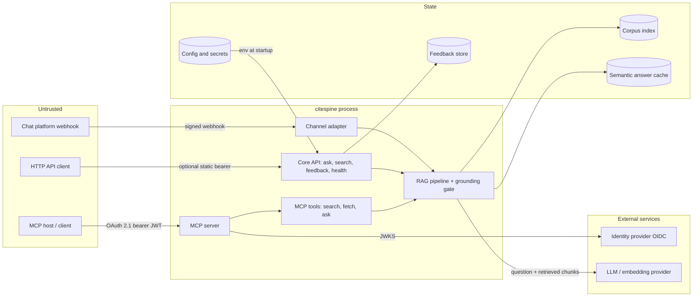

# Threat model

## Scope and method

This models **citespine as deployed**: the HTTP core, the optional channel
adapter, the optional MCP server, and the data they touch. It covers the
software in this repository and the trust boundaries it creates. It does not
model the security of whatever LLM provider, identity provider, or host you
run it against.

Three public frameworks, chosen because a RAG service sits across all three:

| Framework | Why |
| --- | --- |
| [STRIDE](https://learn.microsoft.com/en-us/azure/security/develop/threat-modeling-tool-threats) | Structural decomposition per component and data flow |
| [OWASP Top 10 for LLM Applications 2025](https://genai.owasp.org/llm-top-10/) | Risks specific to retrieval and generation |
| [OWASP MCP Top 10 (2025, beta)](https://owasp.org/www-project-mcp-top-10/) | Risks specific to exposing tools to agents |

[MITRE ATLAS](https://atlas.mitre.org) and
[NIST AI 100-2](https://csrc.nist.gov/pubs/ai/100/2/e2025/final) are
referenced where a threat maps cleanly to a named technique.

**How to read the status column.** *Mitigated* means a control exists in this
repository and a test covers it. *Partial* means a control exists but is
known to be incomplete, and the gap is stated. *Not mitigated* means there is
no control, deliberately or otherwise. Nothing is marked mitigated on the
strength of a code comment alone.

## System decomposition

### Trust boundaries

| # | Boundary | Crossing | Enforcement |
| --- | --- | --- | --- |
| TB1 | Chat platform → adapter | Untrusted webhook | HMAC-SHA256 over raw bytes, 5-minute replay window, constant-time compare (`app/channels/slack.py`) |
| TB2 | API client → core | Untrusted HTTP | Optional static bearer, constant-time compare (`app/main.py`) |
| TB3 | MCP client → MCP server | Untrusted HTTP | OAuth 2.1 resource server: JWKS signature, `iss`, `aud`, `exp`, algorithm allowlist, scope check (`app/mcp_auth.py`) |
| TB4 | Retrieved corpus → generator | **Untrusted data entering the model's context** | Prompt-level instruction only. See LLM01. |
| TB5 | Operator config → process | Trusted by definition | Dotted-path `*_CLASS` settings execute operator code at startup |
| TB6 | Service → LLM provider | Data leaves the deployment | Retrieved chunks and the question are sent to the configured provider |
| TB7 | Caller identity → cache | Authorization boundary | Cache entries partitioned by scope on both entry paths: the HTTP core derives it from the request principal (`app/main.py`), the MCP server from the verified token's `sub` (`app/mcp_server.py`) |

TB4 and TB7 are the two that people building RAG systems most often miss.
TB4 because retrieved documents feel like data rather than instructions. TB7
because a cache hit never reaches the retriever, so any authorization check
that lives in retrieval is simply skipped.

## STRIDE

| Category | Threat | Status | Control, or why not |
| --- | --- | --- | --- |
| **S**poofing | Forged platform webhook | Mitigated | Signature verified on raw bytes before parsing; empty secret rejects everything rather than accepting it (`tests/channels/test_slack_signature.py`) |
| **S**poofing | Forged MCP caller | Mitigated | JWT validated against issuer JWKS with `aud` equal to the canonical resource URL (`tests/test_mcp_auth.py`) |
| **S**poofing | Unauthenticated API caller | **Not mitigated by default** | `/v1` is open unless `API_AUTH_TOKEN` is set. Documented in `docs/DEPLOYMENT.md`; a single shared token is not user authentication. |
| **T**ampering | Request body modified in transit | Mitigated | TB1 signature covers the exact bytes; re-serializing before verification would break it, hence verify-then-parse |
| **T**ampering | Corpus index modified on disk | Not mitigated | No integrity check on `data/index.jsonl`. Anyone who can write the index controls every answer. Treat it as code. |
| **R**epudiation | Tool invocation cannot be attributed | Partial | Every response carries a `request_id`; there is no tamper-resistant audit log of MCP tool calls. See MCP08. |
| **I**nfo disclosure | Raw corpus readable via API | **By design, unauthenticated by default** | `/v1/search` returns verbatim chunks with no grounding gate. This is the endpoint's purpose; authentication is the only control. |
| **I**nfo disclosure | Cross-user answer leakage via cache | Mitigated | Entries partitioned by caller scope; a hit cannot cross scopes (`tests/test_cache_scope.py`) |
| **I**nfo disclosure | Identifiers recoverable from feedback | Partial | HMAC-SHA256 under a secret key, not plain hashing. Pseudonymization, not anonymization: with the key the mapping is recoverable, so rows remain personal data. |
| **D**enial of service | Unbounded request volume or context size | **Not mitigated** | No rate limiting, no per-caller quota, no maximum question length. See LLM10. |
| **D**enial of service | Cache growth | Mitigated | Bounded entry count with oldest-first eviction. Lookup remains a linear scan, so latency grows with cache size. |
| **E**levation of privilege | Arbitrary code execution via config | Accepted by design | `*_CLASS` settings import and run operator-named code. Environment only; never derived from request data, adapter payloads, or tool arguments. |

## OWASP Top 10 for LLM Applications (2025)

| ID | Applies here as | Status | Detail |
| --- | --- | --- | --- |
| LLM01 Prompt Injection | Indirect injection through retrieved documents (TB4) | **Partial, unverified** | The system prompt instructs the model to treat retrieved content and user text as untrusted data and to ignore embedded instructions or authority claims. The literature is clear that prompt-level defense alone is not sufficient (Greshake et al., *Not what you've signed up for*, [arXiv:2302.12173](https://arxiv.org/abs/2302.12173)). There is **no test evidence** in this repository that the defense holds; until an injection suite exists, treat this as an unproven claim. Maps to ATLAS AML.T0051. |
| LLM02 Sensitive Information Disclosure | Corpus content served to unauthenticated callers | Partial | Answers are constrained to retrieved context, but `/v1/search` returns raw chunks and the default deployment has no authentication. There is no document-level authorization: any caller who reaches retrieval reaches the whole corpus. |
| LLM03 Supply Chain | Python and model dependencies | Partial | Small dependency surface, Dependabot, CodeQL. No pinned hashes, no SBOM, no provenance attestation on releases. |
| LLM04 Data and Model Poisoning | Poisoned documents entering the index | **Not mitigated** | Ingestion trusts its source. There is no provenance check, no content signing, and no review step between a `Source` yielding a `Document` and that text reaching a model's context. A single attacker-controlled document changes answers for every user. Maps to ATLAS AML.T0020. |
| LLM05 Improper Output Handling | Model output rendered into a chat client | Partial | Output is markdown converted to Slack `mrkdwn`; there is no HTML or shell sink. A model-emitted link is rendered as a link, so a poisoned corpus could surface an attacker-chosen URL to a user. |
| LLM06 Excessive Agency | Tools available to an agent | **Low by design** | Every MCP tool is read-only with respect to the outside world: `search`, `fetch`, `ask`. None writes to the corpus, spends money on the caller's behalf, or reaches another system. `ask` does populate the answer cache, which is internal state and is partitioned per caller (TB7), so it cannot be used to plant an answer for someone else. Read-only tools are the cheapest strong control here, and it was a design choice rather than an accident. |
| LLM07 System Prompt Leakage | Extraction of the system prompt | **Not applicable** | The prompts are files in this repository (`app/prompts/`). They are public by construction, so there is nothing to leak. Guardrails that depend on prompt secrecy were avoided for this reason. |
| LLM08 Vector and Embedding Weaknesses | Index manipulation, embedding inversion, retrieval-time access gaps | Partial | The cache authorization boundary is enforced (TB7). Index integrity is not (see STRIDE Tampering), and stored embeddings are recoverable to approximate source text by an attacker with file access. |
| LLM09 Misinformation | Confident, wrong answers | Partial | The grounding gate scores faithfulness against retrieved chunks, regenerates once under a stricter prompt, then delivers with an explicit low-confidence note. **The gate's effectiveness is unmeasured**: with the offline extractive generator the judge scores text against itself and always returns ≈1.0, which is a tautology, not evidence. |
| LLM10 Unbounded Consumption | Denial of wallet | **Not mitigated** | No rate limit, no quota, no maximum question or context length beyond the per-chunk cap. Each `/v1/ask` can trigger several provider calls. An unauthenticated public deployment can be made expensive by anyone. The circuit breaker limits damage from provider *failure*, not from provider *cost*. |

## OWASP MCP Top 10 (2025, beta)

Applies only when the MCP server is enabled.

| ID | Status | Detail |
| --- | --- | --- |
| MCP01 Token Mismanagement | Mitigated | The inbound bearer authenticates the caller to this server and is never forwarded upstream. Secrets come from the environment and are not logged. |
| MCP02 Privilege Escalation via Scope Creep | Low | Read-only tools, optional required scopes enforced per request. Scope breadth is an operator decision. |
| MCP03 Tool Poisoning | Accepted by design | `MCP_EXTENSIONS_MODULE` imports exactly the module the operator names, with no plugin scanning. Tool descriptions are env-overridable, which is operator-trusted surface. |
| MCP04 Supply Chain | Partial | Same posture as LLM03. |
| MCP05 Command Injection | Mitigated | No model-supplied argument reaches a shell, a file path, or string-concatenated SQL. `fetch(id)` is an in-memory lookup; the feedback store uses parameterized queries. |
| MCP06 Intent Flow Subversion | Partial, unverified | Same underlying issue as LLM01, and the same lack of test evidence. |
| MCP07 Insufficient AuthN/AuthZ | Mitigated when enabled, **absent by default** | Full resource-server validation with the canonical-URL rule; missing scope returns 403 rather than 401. `MCP_AUTH_MODE` defaults to `off`, which is correct for a local demo and wrong for anything reachable. |
| MCP08 Lack of Audit and Telemetry | **Not mitigated** | Tool invocations are not recorded with caller identity, arguments, and outcome. After an incident you could not reconstruct who called what. The verified claims are now available at the tool layer via `current_claims()`, so what remains missing is the log sink, not the plumbing. |
| MCP09 Shadow MCP Servers | Out of scope | Organizational control, not a property of this software. |
| MCP10 Context Injection and Over-Sharing | Mitigated | Answer cache is partitioned by the verified token subject, so one caller's answer cannot be served to another; no conversation state persists server-side (`history` is client-held, which keeps the core stateless). Covered by `tests/test_mcp_identity.py`, including that claims do not leak between requests. |

## What this system does not protect against

Stated plainly, because a threat model that only lists wins is marketing.

- **Document-level authorization.** There is none. Every caller who can
  retrieve can retrieve everything. Do not point this at a corpus with mixed
  sensitivity and expect per-user filtering.
- **A poisoned corpus.** Ingestion trusts its source completely. Corpus
  integrity is the single highest-value target in the system.
- **Cost exhaustion.** No rate limiting anywhere.
- **Prompt injection, verifiably.** Defenses exist; evidence does not.
- **A compromised host or index file.** Write access to `data/` is equivalent
  to control over every answer.
- **Data residency.** Retrieved chunks are sent to whichever provider is
  configured. With the offline defaults nothing leaves the process; with
  `GENERATION_PROVIDER=openai` your corpus content does.

## Assumptions

1. The operator is trusted. Environment variables, including the dotted-path
   class settings, are operator-controlled and never derived from user input.
2. The corpus is public or non-sensitive in the default configuration.
3. TLS is terminated by a reverse proxy; this service does not terminate TLS.
4. The identity provider behind MCP authorization is correctly configured,
   in particular that it mints `aud` equal to the canonical resource URL.

## Residual risk, prioritized

| Priority | Risk | Cheapest meaningful fix |
| --- | --- | --- |
| 1 | Unbounded consumption (LLM10) | Per-caller rate limit and a maximum question length |
| 2 | Unverified injection resistance (LLM01, MCP06) | An injection suite run against a real model, published as a dated artifact |
| 3 | No tool audit trail (MCP08) | Structured log per tool call: caller subject, tool, arguments, outcome |
| 4 | Corpus poisoning (LLM04) | Provenance recorded per document at ingestion; integrity check on index load |
| 5 | No document-level authorization | Filter inside the retriever, never after ranking; the cache boundary (TB7) is already in place for it |

Items 1 and 3 are small. Item 2 is the one worth doing next, because it
converts the weakest claim in this document into evidence.

---

Last reviewed 2026-08-17 against the framework versions cited above. This
document describes the code in this repository at that date; re-verify before
relying on it.
